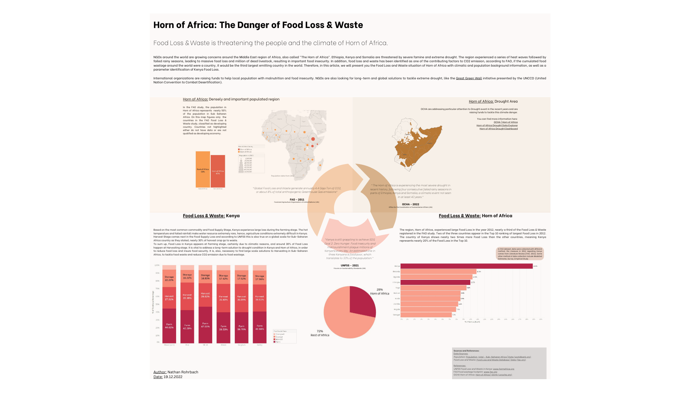

# Horn of Africa: The Danger of Food Loss & Waste
>*Academic Project - Data Visualization and Narration (DVN)*

The objective of this project in *Data Visualization and Narration (DVN)* was to choose a topic from a list, pick a dataset related to the topic, run a Data Exploratory Analysis (EDA) and produce a Data Visualization which tells a story. The goal was to target a  double-page article that would appear in a newspaper/magazine publication similar to [@TheGuardian](https://www.theguardian.com/europe) [@TheEconomist](https://www.economist.com/). 
Our work presents the concerning Food Loss and Waste situation in the Horn of Africa. This region of Africa is exposed to extreme climate condition resulting in agriculture difficulties and important food loss and waste. According to the FAO, *"Global Food Loss and Waste generate annually 4.4 Giga Ton of CO2, or about 8% of total anthropogenic Greenhouse Gas emissions"*. Horn of Africa is one of the most populated area of Africa and the Food security is severly endangered due to climatic condition. This article aims to brings awareness to an educated international public. 

#### Datasets
* [Food Loss and Waste Database|FAO](https://www.fao.org/platform-food-loss-waste/flw-data/en/)
* [Population of Sub-Saharan Africa|Worldbank](https://data.worldbank.org/indicator/SP.POP.TOTL?locations=ZG)

#### References

* [UNFSS Food Loss and Waste in Kenya](https://www.farmafrica.org/latest/news/post/981-unfss-independent-dialogue-on-food-loss-and-waste-in-kenya)
* [FAO Food wastage footprint](https://www.fao.org/fileadmin/templates/nr/sustainability_pathways/docs/FWF_and_climate_change.pdf)
* [OCHA Horn of Africa](https://www.unocha.org/southern-and-eastern-africa)
 
